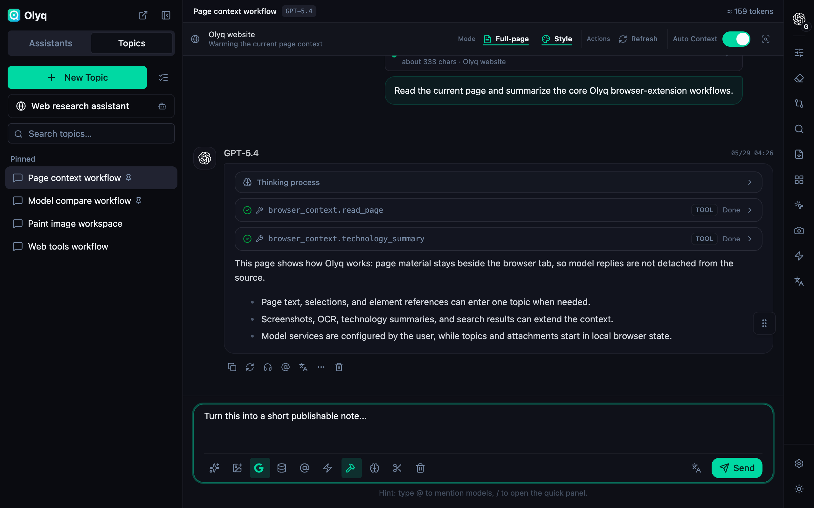
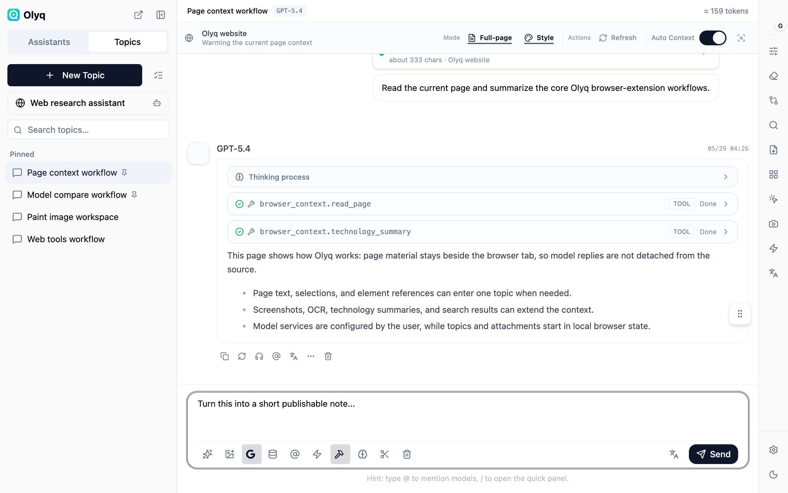
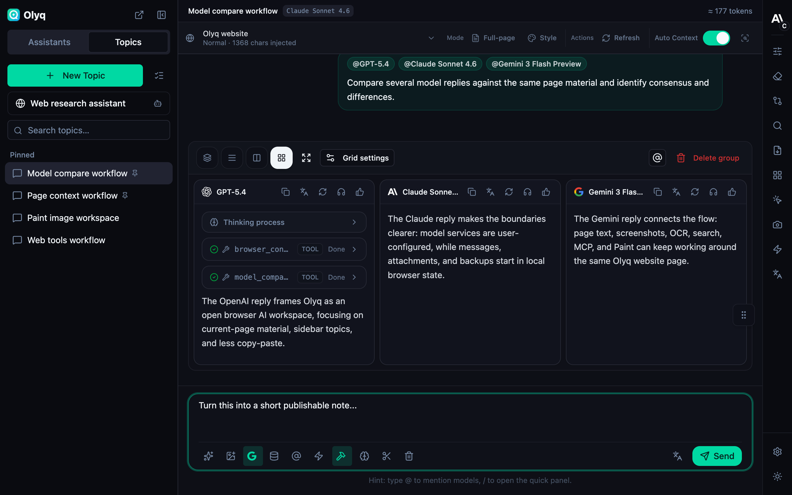
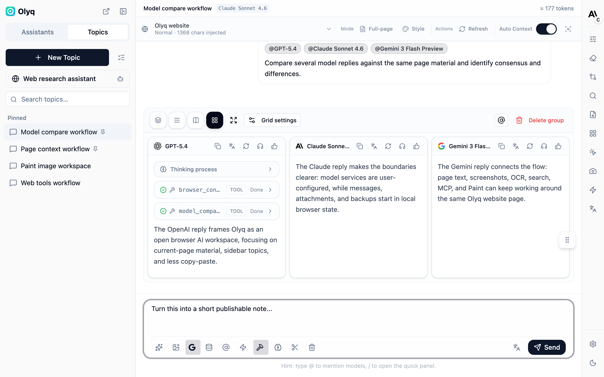
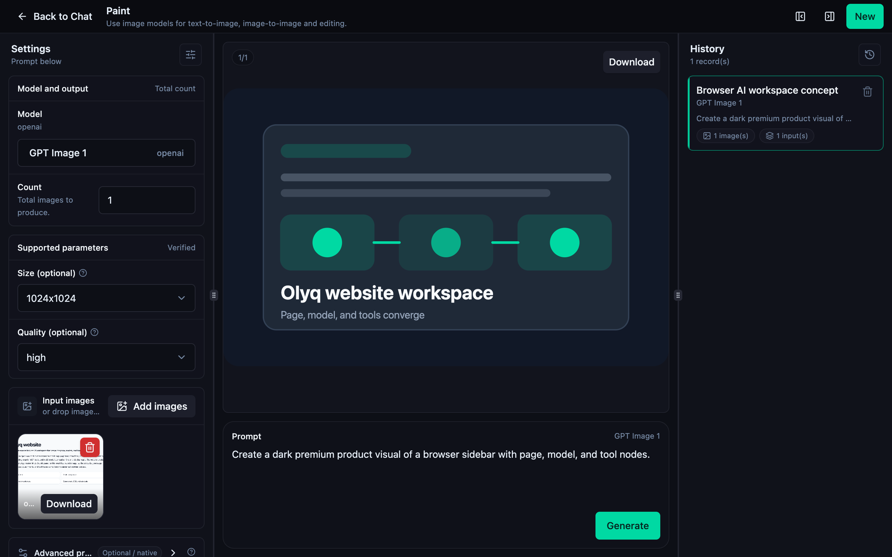
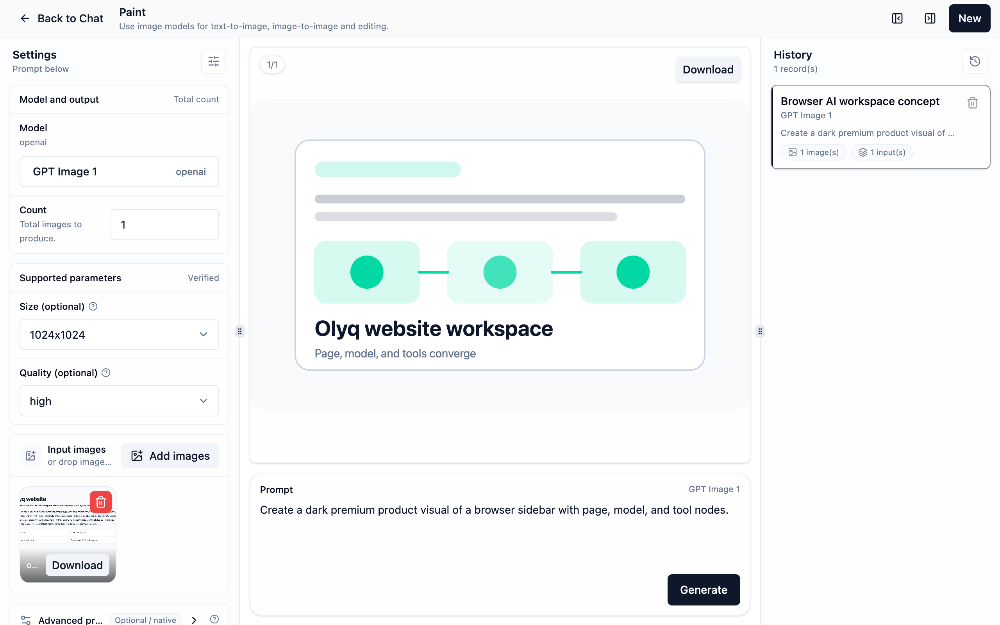
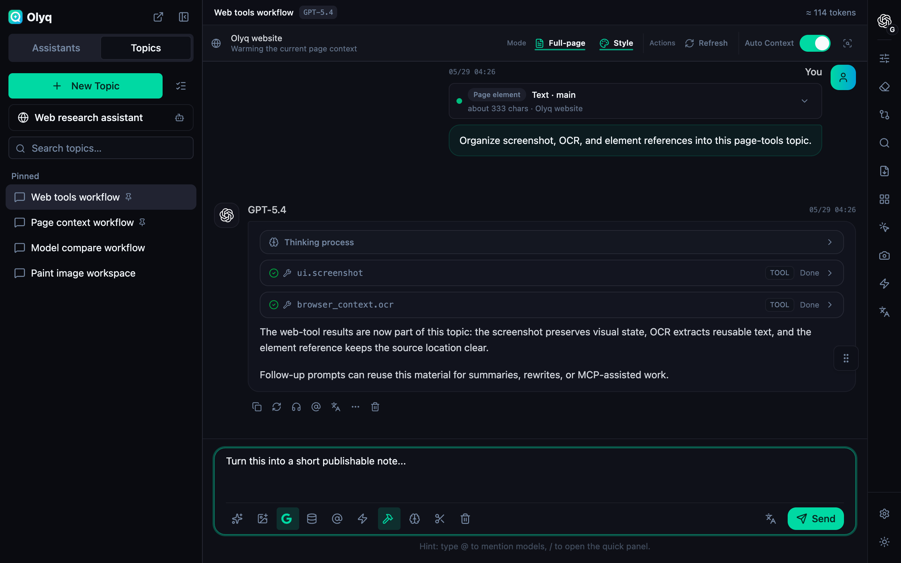
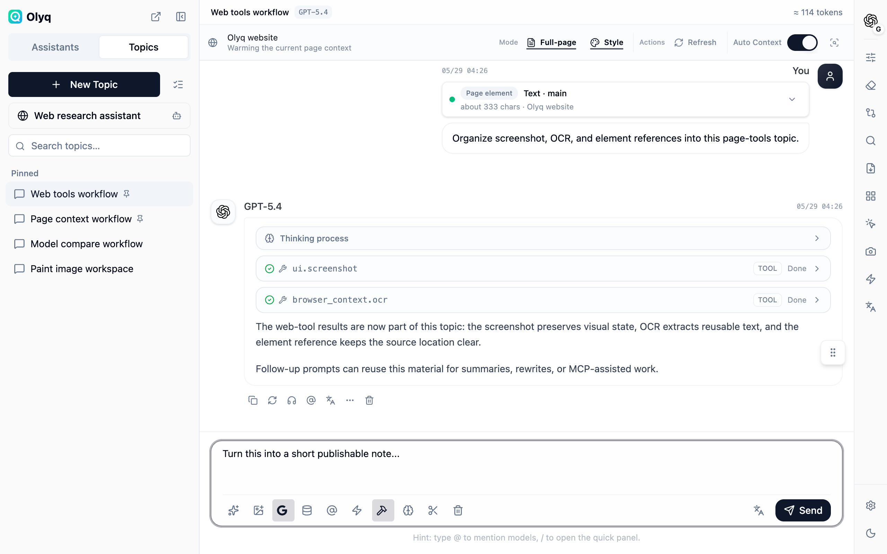

# Olyq

**An open-source multi-model AI workspace for the browser: page context, models, tools, and topics in one sidebar.**

[中文](./README.md)

## What It Is

Olyq is an open-source browser extension. It brings multi-model chat, assistants, topics, page context, page tools, Paint, search, remote MCP, memory, and backups into the browser sidebar, so reading, verification, writing, extraction, image generation, and tool use can happen beside the page you are working on.

The browser is Olyq's workspace. Current-page text, titles, selections, page elements, screenshots, OCR, visual page signals, technology summaries, and search / MCP tool results can all become material in the same topic, without copying content between the page, a chat tab, a screenshot tool, and a model console.

Olyq does not host models, provide credits, choose a provider for you, or implement a knowledge-base RAG product surface. Add your own model service and API key in settings, such as OpenAI, Anthropic, Gemini, OpenRouter, Ollama, or another compatible service. Olyq organizes browser material and sends requests to the models you select.

## What Is In The Workspace

- **Model platforms and model management**: Add multiple model services, manage API hosts, API keys, model lists, default models, and provider order.
- **Assistants and topics**: Use built-in browser-scenario assistants and general assistants, or create your own. Each topic keeps its messages, attachments, model parameters, page-context mode, and prompt settings.
- **Page context**: Bring current-page text, titles, selections, page elements, page state, visual signals, and technology summaries into chat.
- **Page tools**: Select text on the page, point at elements, capture screenshots, annotate, mask sensitive areas, run OCR, and send results back to the sidebar.
- **Multi-model comparison**: Send the same question to several configured models and compare replies in one workspace.
- **Paint**: Use image models in the browser, with prompts, input images, parameters, and result history.
- **Search and remote MCP**: Connect external web search, model-hosted search, and remote MCP tools while keeping tool results in the current topic.
- **Local state and backups**: Settings, assistants, topics, messages, attachments, memory, and backups are stored in the browser by default, with optional WebDAV or S3-compatible remote backups.

## Screenshots

<table>
  <tr>
    <td width="50%"><strong>Page context · Dark</strong> </td>
    <td width="50%"><strong>Page context · Light</strong> </td>
  </tr>
  <tr>
    <td width="50%"><strong>Multi-model compare · Dark</strong> </td>
    <td width="50%"><strong>Multi-model compare · Light</strong> </td>
  </tr>
  <tr>
    <td width="50%"><strong>Paint · Dark</strong> </td>
    <td width="50%"><strong>Paint · Light</strong> </td>
  </tr>
  <tr>
    <td width="50%"><strong>Web tools · Dark</strong> </td>
    <td width="50%"><strong>Web tools · Light</strong> </td>
  </tr>
</table>

## Current Status

- Olyq is not listed on the Chrome Web Store or Firefox Add-ons yet.
- Extension builds are currently published only through [GitHub Releases](../../releases/latest); GitHub Releases is the only source for published build packages.
- Chrome / Chromium users load the unpacked extension locally. Firefox currently uses an unsigned temporary add-on, which is removed after browser restart.
- The project is in active development. Installation, permission, privacy, and release boundaries are kept in the public docs.

## Installation

Olyq is not listed on the Chrome Web Store or Firefox Add-ons yet. For now, download a build from [GitHub Releases](../../releases/latest) and load it locally; GitHub Releases is the only published source for extension builds.

| Browser | Current path | Note |
| ------- | ------------ | ---- |
| Chrome / Chromium | Download `olyq-chrome-web-store-<version>.zip`, unzip it, then load the unpacked extension | Works for local loading and is also the package used for later Chrome Web Store submission |
| Firefox | Download `olyq-firefox-amo-addon-<version>.zip`, unzip it, then temporarily load `manifest.json` | This is an unsigned Firefox package; Firefox removes it after restart |

When store builds are available, Chrome users should install from the Chrome Web Store, and Firefox users should use the AMO / Mozilla-signed `.xpi`.

Each Release also includes `SHA256SUMS.txt` so you can verify the downloaded zip files.

### Chrome / Chromium

1. Download and unzip `olyq-chrome-web-store-<version>.zip`.
2. Open `chrome://extensions`.
3. Enable Developer mode.
4. Choose **Load unpacked**.
5. Select the unzipped directory. If you build from source, run `pnpm build:extension:chromium` in the `olyq/` root, then select only the `olyq/apps/extension/dist` path printed at the end of the command. Do not select the repository-level `olyq/dist` or `olyq/dist-e2e` directories.

### Firefox

1. Download and unzip `olyq-firefox-amo-addon-<version>.zip`.
2. Open `about:debugging#/runtime/this-firefox`.
3. Choose **Load Temporary Add-on**.
4. Select `manifest.json` from the unzipped directory.

Firefox temporary add-ons are removed after browser restart. This is a limitation of unsigned extensions.

## First Run

1. Open a regular web page.
2. Click the Olyq toolbar icon to open the sidebar.
3. Add the model service and API key you want to use in settings.
4. Create or choose an assistant and topic, then ask directly. When needed, select text, capture a screenshot, run OCR, enable search, compare several models, or connect remote MCP tools.

## Privacy And Data Flow

Olyq stores settings, assistants, topics, messages, attachments, memory, and backups in your browser by default. Data leaves the browser only when you configure and use the related capability:

- Model requests, image generation, OCR, and memory embeddings are sent to the model service you configure.
- Web search, model-hosted search, and remote MCP calls send the related queries or tool parameters to their services.
- WebDAV or S3-compatible remote backups write backup data to the storage endpoint you configure.
- Page content, selections, page elements, and screenshots are used only when you invoke page context, page tools, screenshot, or OCR features.

See [PRIVACY.md](./PRIVACY.md) and [SECURITY.md](./SECURITY.md) for details.

## Development And Contributing

Build, test, packaging, release, and store submission notes live in [CONTRIBUTING.en.md](./CONTRIBUTING.en.md). Please report security issues through the private path described in [SECURITY.md](./SECURITY.md).

The public website lives in `apps/www` and is built with Vite + React. Build it with `pnpm --filter @olyq/www build`; GitHub Pages, Cloudflare Pages, and Docker deployment notes live in [apps/www/DEPLOYMENT.md](./apps/www/DEPLOYMENT.md).

## License And Thanks

Olyq is released under the [MIT License](./LICENSE). Third-party license and asset notices are documented in [THIRD_PARTY_NOTICES.md](./THIRD_PARTY_NOTICES.md).

Special thanks to [Cherry Studio](https://github.com/CherryHQ/cherry-studio). Olyq's workspace and several interaction patterns were inspired by Cherry Studio's public product experience. Olyq is an independent project and is not affiliated with or endorsed by Cherry Studio.
