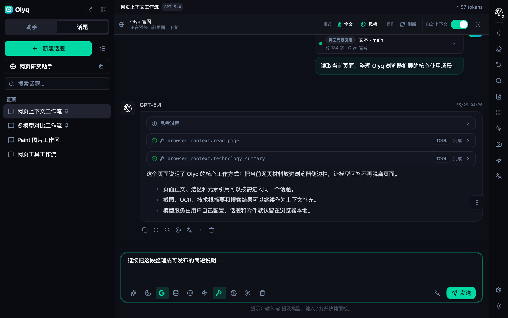
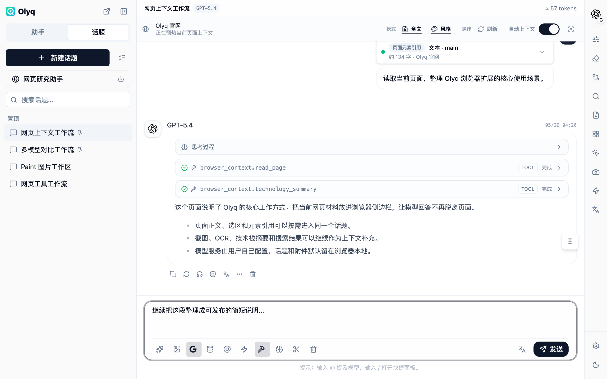
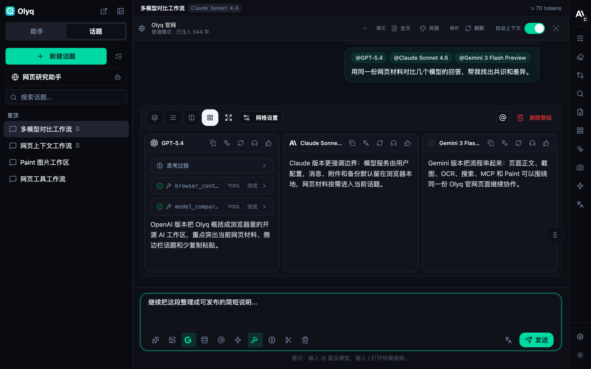
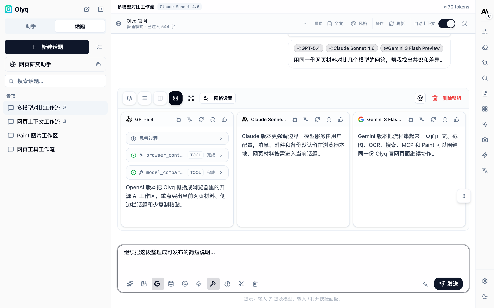
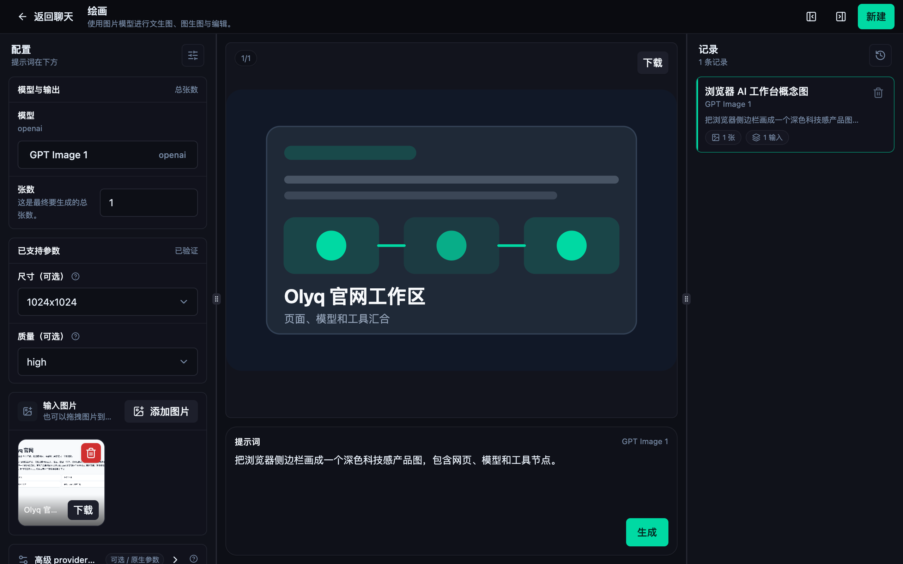
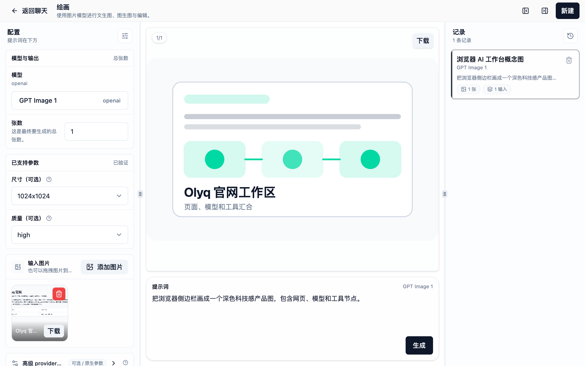
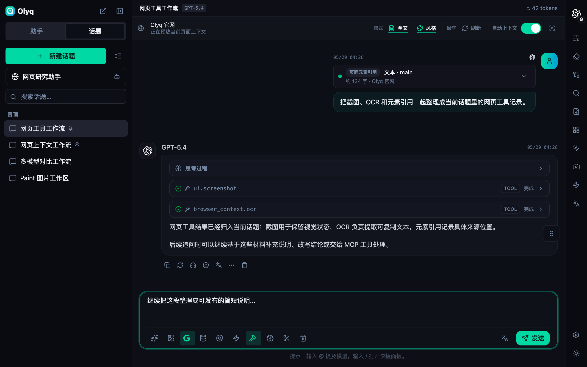
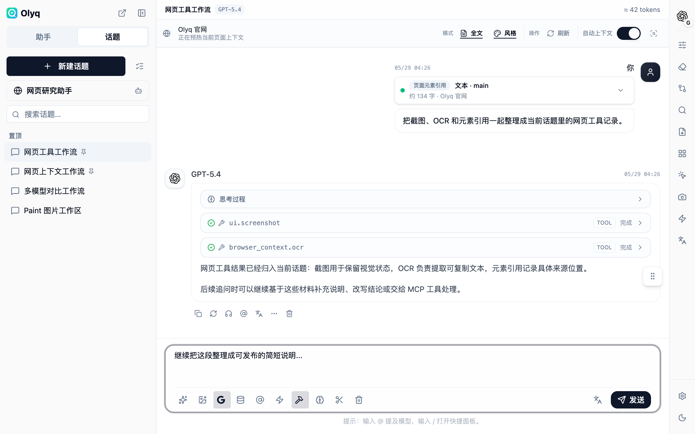

# Olyq

**浏览器里的开源多模型 AI 工作台：把当前网页、模型、工具和话题放进同一个侧边栏。**

[English](./README.en.md)

## 是什么

Olyq 是一个开源浏览器扩展。它把多模型对话、助手、话题、网页上下文、页面工具、Paint、搜索、远程 MCP、记忆和备份放进浏览器侧边栏，让你在当前网页旁边完成阅读、核验、写作、提取、图片生成和工具调用。

浏览器是 Olyq 的工作现场。当前页面正文、标题、选区、页面元素、截图、OCR、页面视觉线索、技术栈摘要和搜索 / MCP 工具结果都可以成为同一个话题里的材料，不需要在网页、聊天窗口、截图工具和模型控制台之间来回搬运。

Olyq 不托管模型，不代管额度，不替你选择供应商，也不提供知识库 RAG 产品面。你需要在设置里添加自己的模型服务和 API Key，例如 OpenAI、Anthropic、Gemini、OpenRouter、Ollama，或其它兼容服务；Olyq 负责把浏览器里的材料组织好，再交给你选择的模型。

## 工作台里有什么

- **模型平台与模型管理**：添加多个模型服务，管理 API 地址、API Key、模型列表、默认模型和 provider 顺序。
- **助手与话题**：内置浏览器场景助手和通用助手，也可以创建自己的助手；每个话题保留消息、附件、模型参数、页面上下文模式和提示词设置。
- **网页上下文**：把当前网页正文、标题、选区、页面元素、页面状态、视觉线索和技术栈摘要带进对话。
- **页面工具**：在网页上划词、点选元素、截图、标注、遮挡敏感区域、OCR，再把结果送回侧边栏。
- **多模型比较**：同一个问题可以并行发送给多个已配置模型，在同一工作区里对照回答。
- **Paint**：在浏览器里使用图片模型，管理提示词、输入图、参数和历史结果。
- **搜索与远程 MCP**：接入外部联网搜索、模型内置搜索和远程 MCP 工具，让工具结果留在当前话题里。
- **本地状态与备份**：设置、助手、话题、消息、附件、记忆和备份默认保存在浏览器本地，也可以按需配置 WebDAV 或 S3-compatible 远程备份。

## 截图

<table>
  <tr>
    <td width="50%"><strong>网页上下文 · 深色</strong> </td>
    <td width="50%"><strong>网页上下文 · 浅色</strong> </td>
  </tr>
  <tr>
    <td width="50%"><strong>多模型对比 · 深色</strong> </td>
    <td width="50%"><strong>多模型对比 · 浅色</strong> </td>
  </tr>
  <tr>
    <td width="50%"><strong>Paint · 深色</strong> </td>
    <td width="50%"><strong>Paint · 浅色</strong> </td>
  </tr>
  <tr>
    <td width="50%"><strong>网页工具 · 深色</strong> </td>
    <td width="50%"><strong>网页工具 · 浅色</strong> </td>
  </tr>
</table>

## 现在的状态

- Olyq 还没有上架 Chrome Web Store 或 Firefox Add-ons。
- 当前构建包只通过 [GitHub Releases](../../releases/latest) 发布；GitHub Releases 是唯一的构建包来源。
- Chrome / Chromium 需要本地加载已解压扩展；Firefox 当前使用未签名临时扩展，浏览器重启后会失效。
- 项目处于活跃开发中。安装、权限、隐私和发布边界会在公开文档里保持同步。

## 安装

Olyq 还没有上架 Chrome Web Store 或 Firefox Add-ons。当前请从 [GitHub Releases](../../releases/latest) 下载构建包后本地加载；GitHub Releases 是唯一的构建包发布来源。

| 浏览器 | 现在怎么用 | 注意 |
| ------ | ---------- | ---- |
| Chrome / Chromium | 下载 `olyq-chrome-web-store-<version>.zip`，解压后加载已解压的扩展 | 适合本地加载，也会作为后续 Chrome Web Store 提交包 |
| Firefox | 下载 `olyq-firefox-amo-addon-<version>.zip`，解压后临时加载 `manifest.json` | 这是未签名的 Firefox 包；重启浏览器后会失效 |

商店版发布后，Chrome 用户应优先从 Chrome Web Store 安装；Firefox 用户应使用 AMO / Mozilla 签名后的 `.xpi`。

Release 里会同时提供 `SHA256SUMS.txt`。下载后可以用它核对 zip 文件。

### Chrome / Chromium

1. 下载 `olyq-chrome-web-store-<version>.zip` 并解压。
2. 打开 `chrome://extensions`。
3. 启用开发者模式。
4. 选择 **加载已解压的扩展程序**。
5. 选择解压后的目录；如果是从源码本地构建，请在 `olyq/` 根目录运行 `pnpm build:extension:chromium`，然后只选择命令末尾打印的 `olyq/apps/extension/dist`，不要选择仓库根级 `olyq/dist` 或 `olyq/dist-e2e`。

### Firefox

1. 下载 `olyq-firefox-amo-addon-<version>.zip` 并解压。
2. 打开 `about:debugging#/runtime/this-firefox`。
3. 选择 **临时载入附加组件**。
4. 选择解压目录中的 `manifest.json`。

Firefox 临时扩展会在浏览器重启后失效，这是未签名扩展的限制。

## 第一次使用

1. 打开一个普通网页。
2. 点击浏览器工具栏里的 Olyq 图标，打开侧边栏。
3. 在设置里添加你要用的模型服务和 API Key。
4. 回到页面，创建或选择助手与话题，然后直接提问；需要时再选中文本、截图、OCR、启用搜索、比较多个模型或连接远程 MCP 工具。

## 隐私与数据流

Olyq 默认把设置、助手、话题、消息、附件、记忆和备份保存在浏览器本地。数据只有在你配置并使用对应能力时才会发往外部服务：

- 向模型提问、生成图片、OCR 或生成记忆向量时，请求会发往你配置的模型服务。
- 启用联网搜索、模型内置搜索或远程 MCP 时，相关查询和工具参数会发往对应服务。
- 启用 WebDAV 或 S3-compatible 远程备份时，备份数据会写入你配置的存储端。
- 网页内容、选区、页面元素和截图只会在你使用页面上下文、页面工具、截图或 OCR 等功能时参与处理。

更多细节见 [PRIVACY.md](./PRIVACY.md) 和 [SECURITY.md](./SECURITY.md)。

## 开发与贡献

构建、测试、打包、发布和商店提交说明见 [CONTRIBUTING.md](./CONTRIBUTING.md)。安全问题请按 [SECURITY.md](./SECURITY.md) 里的私密报告路径提交。

公开官网在 `apps/www`，使用 Vite + React 构建。官网构建命令是 `pnpm --filter @olyq/www build`；GitHub Pages、Cloudflare Pages 和 Docker 部署说明见 [apps/www/DEPLOYMENT.md](./apps/www/DEPLOYMENT.md)。

## 许可证与致谢

Olyq 使用 [MIT License](./LICENSE)。第三方许可和素材声明见 [THIRD_PARTY_NOTICES.md](./THIRD_PARTY_NOTICES.md)。

特别感谢 [Cherry Studio](https://github.com/CherryHQ/cherry-studio)。Olyq 的工作台和部分交互设计参考了 Cherry Studio 的公开产品体验。Olyq 是独立项目，与 Cherry Studio 没有关联或背书关系。
